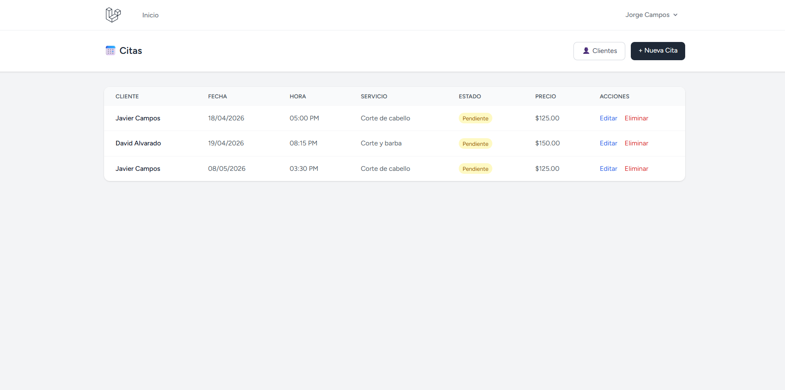

# 📅 Sistema de Agenda y Citas — Barbería

Sistema web desarrollado con Laravel para la gestión de citas y clientes de una barbería.

## ✨ Funcionalidades

- Autenticación de usuarios (registro, login, perfil)
- Gestión completa de clientes (CRUD)
- Agendado de citas con fecha, hora, servicio y precio
- Estados de cita: pendiente, confirmada y cancelada
- Filtrado de citas por usuario autenticado

## 🚀 Tecnologías

- Laravel (PHP)
- MySQL
- Blade Templates
- Tailwind CSS
- Git / GitHub

## 📸 Vista previa

## ▶️ Instalación

1. Clona el repositorio
2. Ejecuta `composer install`
3. Copia `.env.example` a `.env` y configura tu base de datos
4. Ejecuta `php artisan key:generate`
5. Ejecuta `php artisan migrate`
6. Ejecuta `php artisan serve`

## 👨‍💻 Autor

**Jorge Campos Albarado** — [GitHub](https://github.com/JorgeCA7)